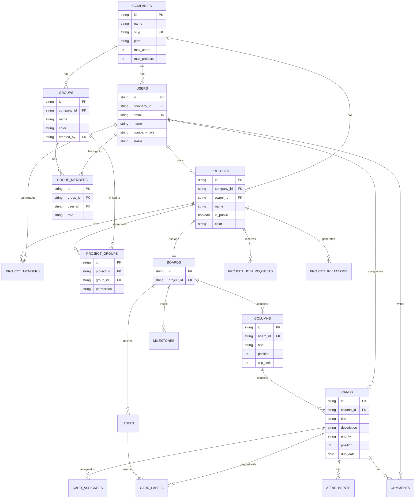
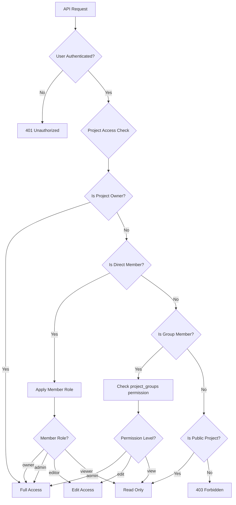
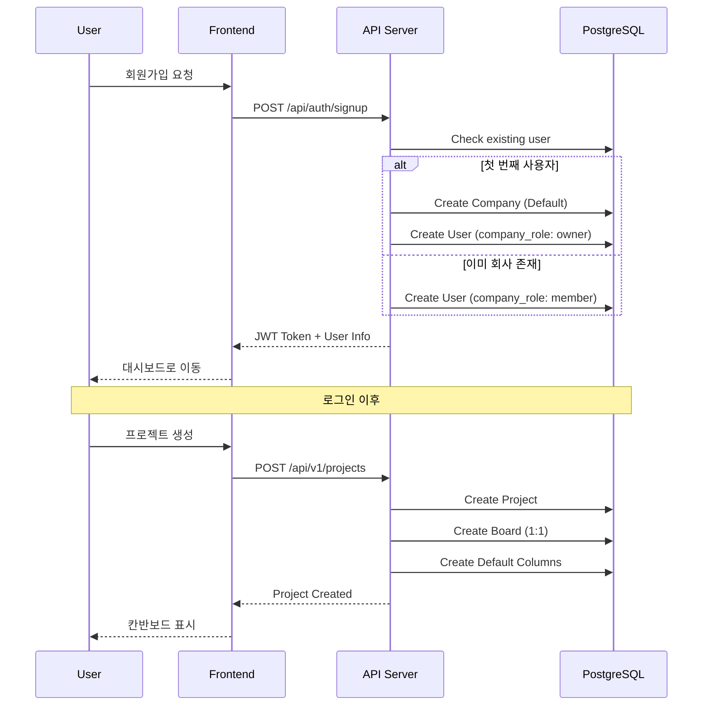
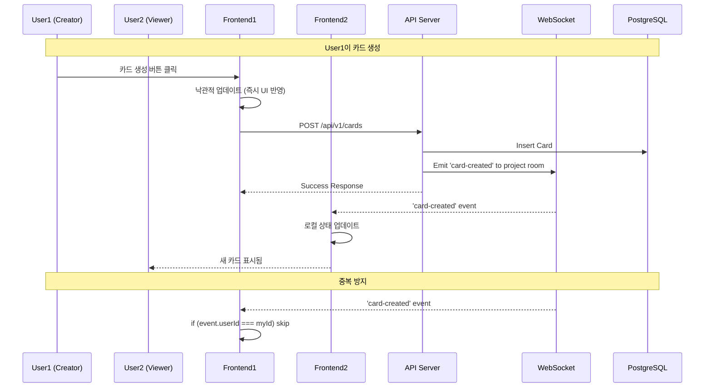
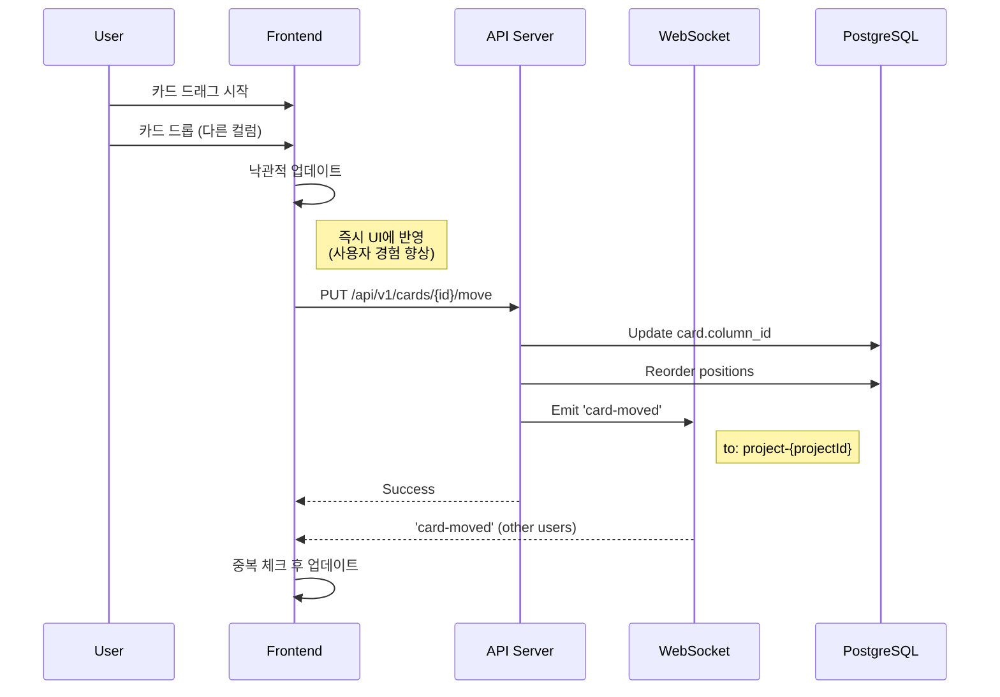
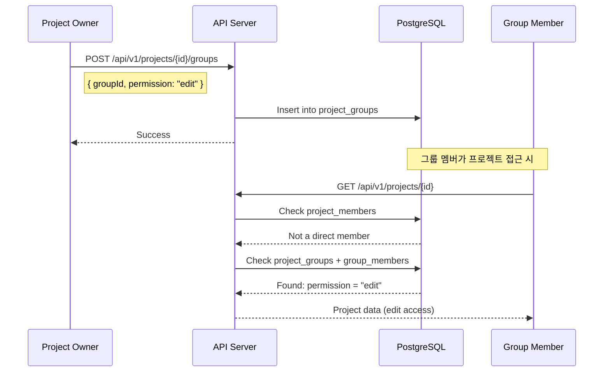

# 칸반보드 시스템 아키텍처 문서

> 작성일: 2024-12-28
> 버전: 2.0 (Organization → Group 마이그레이션 후)

---

## 1. 시스템 아키텍처 개요

```
┌─────────────────────────────────────────────────────────────────────────────────────┐
│                                   FRONTEND (Next.js)                                 │
├─────────────────────────────────────────────────────────────────────────────────────┤
│  ┌──────────────┐  ┌──────────────┐  ┌──────────────┐  ┌──────────────────────────┐ │
│  │    Pages     │  │  Components  │  │   Contexts   │  │         Hooks            │ │
│  ├──────────────┤  ├──────────────┤  ├──────────────┤  ├──────────────────────────┤ │
│  │ /            │  │ KanbanBoard  │  │ AuthContext  │  │ useKanbanAPI             │ │
│  │ /[projectId] │  │ CardModal    │  │ ProjectCtx   │  │ useSocket                │ │
│  │ /settings/*  │  │ Sidebar      │  │ GroupContext │  │ useGlobalWebSocketEvents │ │
│  │ /api-docs    │  │ Layout       │  │ ToastContext │  │                          │ │
│  └──────────────┘  └──────────────┘  └──────────────┘  └──────────────────────────┘ │
└─────────────────────────────────────────────────────────────────────────────────────┘
                                           │
                    ┌──────────────────────┴──────────────────────┐
                    │              HTTP / WebSocket                │
                    ▼                                              ▼
┌─────────────────────────────────────────┐    ┌──────────────────────────────────────┐
│           REST API (pages/api/v1)       │    │         WebSocket (Socket.IO)        │
├─────────────────────────────────────────┤    ├──────────────────────────────────────┤
│  ┌─────────────┐  ┌──────────────────┐  │    │  Rooms:                              │
│  │ Middleware  │  │   Endpoints      │  │    │  ├── user-{userId}                   │
│  ├─────────────┤  ├──────────────────┤  │    │  └── project-{projectId}             │
│  │ Auth        │  │ /projects        │  │    │                                      │
│  │ RBAC        │  │ /cards           │  │    │  Events:                             │
│  │ Audit       │  │ /groups          │  │    │  ├── card-created/updated/moved      │
│  │ Rate Limit  │  │ /users           │  │    │  ├── project-join-request            │
│  │ Validation  │  │ /companies       │  │    │  └── member-added/removed            │
│  └─────────────┘  └──────────────────┘  │    └──────────────────────────────────────┘
└─────────────────────────────────────────┘
                    │
                    ▼
┌─────────────────────────────────────────────────────────────────────────────────────┐
│                            REPOSITORY LAYER (lib/repositories)                       │
├─────────────────────────────────────────────────────────────────────────────────────┤
│  UserRepo │ ProjectRepo │ BoardRepo │ CardRepo │ GroupRepo │ CommentRepo │ AuditRepo │
└─────────────────────────────────────────────────────────────────────────────────────┘
                    │
                    ▼
┌─────────────────────────────────────────────────────────────────────────────────────┐
│                              PostgreSQL Database                                     │
│  ┌──────────────────────────────────────────────────────────────────────────────┐  │
│  │  companies ──┬── users ──┬── projects ──┬── boards ──┬── columns ── cards    │  │
│  │              │           │              │            └── milestones          │  │
│  │              ├── groups ─┴── project_groups          └── labels              │  │
│  │              └── group_members                                               │  │
│  └──────────────────────────────────────────────────────────────────────────────┘  │
└─────────────────────────────────────────────────────────────────────────────────────┘
```

---

## 2. 데이터베이스 ER 다이어그램



### 테이블 상세

| 테이블 | 설명 | 주요 필드 |
|--------|------|-----------|
| `companies` | 테넌트 (회사) | id, name, slug, plan, max_users |
| `users` | 사용자 | id, company_id, email, name, company_role |
| `groups` | 그룹 (권한 컨테이너) | id, company_id, name, color, created_by |
| `group_members` | 그룹 멤버십 | group_id, user_id, role |
| `projects` | 프로젝트 | id, company_id, owner_id, name, is_public |
| `project_members` | 프로젝트 멤버 | project_id, user_id, role |
| `project_groups` | 프로젝트-그룹 연결 | project_id, group_id, permission |
| `boards` | 칸반 보드 (1:1 with project) | id, project_id |
| `columns` | 보드 컬럼 | id, board_id, title, position, wip_limit |
| `cards` | 작업 카드 | id, column_id, title, priority, position |
| `labels` | 라벨 | id, board_id, name, color |
| `milestones` | 마일스톤 | id, board_id, name, due_date |
| `comments` | 카드 댓글 | id, card_id, user_id, content |
| `attachments` | 카드 첨부파일 | id, card_id, file_url |
| `audit_logs` | 감사 로그 | id, user_id, action, resource_type |

---

## 3. 권한/거버넌스 체계

### 권한 계층 구조

```
┌─────────────────────────────────────────────────────────────────────────────────────┐
│                           PERMISSION HIERARCHY                                       │
├─────────────────────────────────────────────────────────────────────────────────────┤
│                                                                                      │
│   COMPANY LEVEL                                                                      │
│   ├── owner   : 회사 전체 관리, 플랜 변경, 사용자 관리                               │
│   ├── admin   : 사용자 관리, 프로젝트 생성                                           │
│   └── member  : 기본 접근                                                            │
│                                                                                      │
│   GROUP LEVEL (NEW!)                                                                 │
│   ├── admin   : 그룹 설정, 멤버 관리                                                 │
│   └── member  : 그룹 참여                                                            │
│                                                                                      │
│   PROJECT LEVEL                                                                      │
│   ├── owner   : 프로젝트 삭제, 멤버 관리, 설정                                       │
│   ├── admin   : 컬럼 관리, 라벨/마일스톤 관리                                        │
│   ├── editor  : 카드 CRUD, 댓글                                                      │
│   └── viewer  : 읽기 전용                                                            │
│                                                                                      │
└─────────────────────────────────────────────────────────────────────────────────────┘
```

### 프로젝트 접근 경로

```
PROJECT ACCESS PATHS
┌─────────────────────────────────────────────────────────────────────────────┐
│  1. Direct Membership (project_members)                                      │
│     User ──────────────────────────────────────────────> Project             │
│                                                                              │
│  2. Group-based Access (project_groups) ← NEW!                               │
│     User ──> Group ──> ProjectGroup ──> Project                              │
│                         (permission: view/edit/admin)                        │
│                                                                              │
│  3. Public Project                                                           │
│     is_public = true → Anyone can view/request to join                       │
└─────────────────────────────────────────────────────────────────────────────┘
```

### 권한 체크 플로우



---

## 4. 핵심 워크플로우

### A. 사용자 온보딩 플로우



### B. 카드 생성 및 실시간 동기화



### C. 카드 이동 (Drag & Drop)



### D. 그룹 기반 프로젝트 공유 (NEW!)



---

## 5. API 엔드포인트 구조

```
/api/v1/
│
├── auth/
│   ├── POST   login              # 로그인
│   └── POST   signup             # 회원가입
│
├── users/
│   ├── GET    /                  # 사용자 목록
│   └── GET    /search            # 사용자 검색
│
├── companies/
│   └── GET    /                  # 회사 정보
│
├── groups/                       # ← NEW! 그룹 관리
│   ├── GET    /                  # 그룹 목록
│   ├── POST   /                  # 그룹 생성
│   ├── GET    /{id}              # 그룹 상세
│   ├── PATCH  /{id}              # 그룹 수정
│   ├── DELETE /{id}              # 그룹 삭제
│   └── /members/
│       ├── GET    /              # 멤버 목록
│       ├── POST   /              # 멤버 추가
│       ├── PATCH  /{userId}      # 역할 변경
│       └── DELETE /{userId}      # 멤버 제거
│
├── projects/
│   ├── GET    /                  # 프로젝트 목록
│   ├── POST   /                  # 프로젝트 생성
│   ├── GET    /{id}              # 프로젝트 상세
│   ├── PATCH  /{id}              # 프로젝트 수정
│   ├── DELETE /{id}              # 프로젝트 삭제
│   │
│   ├── /board
│   │   └── GET /                 # 보드 + 컬럼 + 카드 전체 조회
│   │
│   ├── /columns/
│   │   ├── GET    /              # 컬럼 목록
│   │   ├── POST   /              # 컬럼 생성
│   │   ├── PATCH  /{id}          # 컬럼 수정
│   │   ├── DELETE /{id}          # 컬럼 삭제
│   │   └── PUT    /reorder       # 컬럼 순서 변경
│   │
│   ├── /members/
│   │   ├── GET    /              # 멤버 목록
│   │   ├── POST   /              # 멤버 추가
│   │   ├── POST   /invite        # 초대 발송
│   │   └── DELETE /{userId}      # 멤버 제거
│   │
│   ├── /groups/                  # ← NEW! 프로젝트-그룹 연결
│   │   ├── GET    /              # 연결된 그룹
│   │   ├── POST   /              # 그룹 연결
│   │   ├── PATCH  /{groupId}     # 권한 수정
│   │   └── DELETE /{groupId}     # 연결 해제
│   │
│   ├── /join-requests/
│   │   ├── GET    /              # 가입 신청 목록
│   │   ├── POST   /{id}/approve  # 승인
│   │   └── POST   /{id}/reject   # 거부
│   │
│   ├── /labels/                  # 라벨 CRUD
│   ├── /milestones/              # 마일스톤 CRUD
│   └── /invites/                 # 초대 링크 관리
│
├── cards/
│   ├── GET    /                  # 카드 목록
│   ├── POST   /                  # 카드 생성
│   ├── GET    /{id}              # 카드 상세
│   ├── PUT    /{id}              # 카드 수정
│   ├── DELETE /{id}              # 카드 삭제
│   ├── PUT    /{id}/move         # 카드 이동
│   │
│   ├── /comments/
│   │   ├── GET    /              # 댓글 목록
│   │   ├── POST   /              # 댓글 작성
│   │   ├── PATCH  /{id}          # 댓글 수정
│   │   └── DELETE /{id}          # 댓글 삭제
│   │
│   └── /attachments/             # 첨부파일 CRUD
│
├── api-keys/                     # API 키 관리
│   ├── GET    /
│   ├── POST   /
│   ├── DELETE /{id}
│   └── /{id}/revoke
│
└── audit-logs/                   # 감사 로그
    ├── GET    /
    ├── GET    /{id}
    └── GET    /statistics
```

---

## 6. WebSocket 이벤트 흐름

### Room 구조

| Room Pattern | 용도 | 예시 |
|--------------|------|------|
| `user-{userId}` | 개인 알림 | `user-abc123` |
| `project-{projectId}` | 프로젝트 실시간 동기화 | `project-xyz789` |

### 이벤트 타입

```
┌──────────────────────────────────────────────────────────────────────────────┐
│                          EVENT TYPES                                          │
├──────────────────────────────────────────────────────────────────────────────┤
│                                                                               │
│  CARD EVENTS (to: project-{projectId})                                        │
│  ├── card-created    { card, user, columnId }                                 │
│  ├── card-updated    { card, user }                                           │
│  ├── card-moved      { card, user, fromColumn, toColumn, destinationIndex }   │
│  └── card-deleted    { cardId, user }                                         │
│                                                                               │
│  COLUMN EVENTS (to: project-{projectId})                                      │
│  ├── column-created  { column }                                               │
│  ├── column-updated  { column }                                               │
│  └── column-deleted  { columnId }                                             │
│                                                                               │
│  MEMBER EVENTS                                                                │
│  ├── project-join-request  (to: user-{ownerId})                               │
│  ├── join-request-approved (to: user-{requesterId})                           │
│  └── member-added/removed  (to: project-{projectId})                          │
│                                                                               │
└──────────────────────────────────────────────────────────────────────────────┘
```

### 중복 방지 전략

```typescript
// useKanbanAPI.ts
const eventKey = `${eventType}-${cardId}-${userId}-${timestamp}`;
if (processedEvents.has(eventKey)) return; // 중복 무시
processedEvents.add(eventKey);
setTimeout(() => processedEvents.delete(eventKey), 5000); // 5초 후 정리
```

---

## 7. 현재 구조의 문제점 및 개선 포인트

### 발견된 이슈

| 우선순위 | 카테고리 | 이슈 | 설명 |
|---------|---------|------|------|
| **HIGH** | Governance | 그룹 기반 접근 권한 미구현 | `project_groups` 테이블은 있으나 실제 권한 체크 로직 없음 |
| **HIGH** | Governance | RBAC 미들웨어 약화됨 | 조직 제거하면서 권한 체크 로직도 제거됨 |
| **HIGH** | Governance | Company 레벨 권한 미구현 | `company_role` (owner/admin/member) 실제 적용 안됨 |
| **MED** | Data | organizationId 레거시 참조 | `types/index.ts`와 DB schema에 아직 존재 |
| **MED** | Data | Card position 관리 불안정 | 드래그&드롭 시 position 값 충돌 가능성 |
| **MED** | Audit | 감사 로그 범위 제한적 | 카드/컬럼 변경만 기록, 멤버 변경 등 미기록 |
| **LOW** | Security | Rate Limiting 미적용 | API rate limiting 로직 있으나 실제 적용 안됨 |

### 권장 개선 우선순위

```
┌──────────────────────────────────────────────────────────────────────────────┐
│  1. [HIGH] 그룹 기반 프로젝트 접근 권한 체크 구현                             │
│  2. [HIGH] RBAC 미들웨어 그룹 권한으로 재구현                                 │
│  3. [MED]  organizationId 레거시 완전 제거                                    │
│  4. [MED]  감사 로그 범위 확대                                                │
│  5. [LOW]  Card position 안정성 개선                                          │
└──────────────────────────────────────────────────────────────────────────────┘
```

---

## 8. 파일 구조

```
kanban-board/
├── pages/
│   ├── api/
│   │   ├── v1/                    # REST API 엔드포인트
│   │   │   ├── projects/
│   │   │   ├── cards/
│   │   │   ├── groups/            # NEW
│   │   │   └── ...
│   │   ├── auth/                  # 인증 API
│   │   └── websocket.ts           # WebSocket 서버
│   ├── [projectId].tsx            # 칸반보드 페이지
│   ├── settings/
│   │   ├── groups.tsx             # NEW: 그룹 관리
│   │   └── api-keys.tsx
│   └── index.tsx                  # 홈/대시보드
│
├── components/
│   ├── KanbanBoard.tsx            # 메인 칸반 컴포넌트
│   ├── CardModal.tsx              # 카드 상세 모달
│   ├── ProjectSelector.tsx        # 프로젝트 선택기
│   ├── ProjectSettingsModal.tsx   # 프로젝트 설정
│   ├── Sidebar.tsx                # 사이드바
│   └── Layout.tsx                 # 레이아웃
│
├── contexts/
│   ├── AuthContext.tsx            # 인증 상태
│   ├── ProjectContext.tsx         # 프로젝트 상태
│   ├── GroupContext.tsx           # NEW: 그룹 상태
│   ├── ToastContext.tsx           # 알림
│   └── ThemeContext.tsx           # 테마
│
├── hooks/
│   ├── useKanbanAPI.ts            # 칸반 API + 실시간 동기화
│   ├── useSocket.ts               # WebSocket 연결
│   └── useGlobalWebSocketEvents.ts
│
├── lib/
│   ├── repositories/              # 데이터 접근 계층
│   │   ├── user.repository.ts
│   │   ├── project.repository.ts
│   │   ├── board.repository.ts
│   │   ├── card.repository.ts
│   │   ├── group.repository.ts    # NEW
│   │   └── ...
│   ├── api-v1/
│   │   ├── middleware/            # API 미들웨어
│   │   │   ├── auth.ts
│   │   │   ├── rbac.ts
│   │   │   └── audit.ts
│   │   └── utils/
│   └── postgres.ts                # DB 연결
│
└── types/
    └── index.ts                   # TypeScript 타입 정의
```

---

## 9. 기술 스택

| 분류 | 기술 | 버전/설명 |
|------|------|----------|
| **Frontend** | Next.js | 14.x (Pages Router) |
| | React | 18.x |
| | TypeScript | 5.x |
| | Tailwind CSS | 3.x |
| | @hello-pangea/dnd | Drag & Drop |
| **Backend** | Next.js API Routes | REST API |
| | Socket.IO | 실시간 통신 |
| | PostgreSQL | 데이터베이스 |
| **인프라** | (설정 필요) | Vercel, AWS 등 |

---

## 10. 다음 단계 제안

### Phase 1: 권한 시스템 강화
1. `checkProjectAccess()` 함수 구현 (그룹 기반 접근 포함)
2. RBAC 미들웨어에 그룹 권한 체크 로직 추가
3. 프로젝트 목록 API에서 그룹 기반 접근 가능 프로젝트 포함

### Phase 2: 레거시 정리
1. `organizationId` 필드 완전 제거 (types, DB schema)
2. 관련 마이그레이션 스크립트 정리
3. 테스트 코드 업데이트

### Phase 3: 기능 확장
1. 그룹 기반 프로젝트 공유 UI 구현
2. 감사 로그 확대 (멤버 변경, 권한 변경 등)
3. 대시보드에 그룹 통계 추가

---

*이 문서는 시스템 구조 이해와 개선 방향 설정을 위해 작성되었습니다.*
