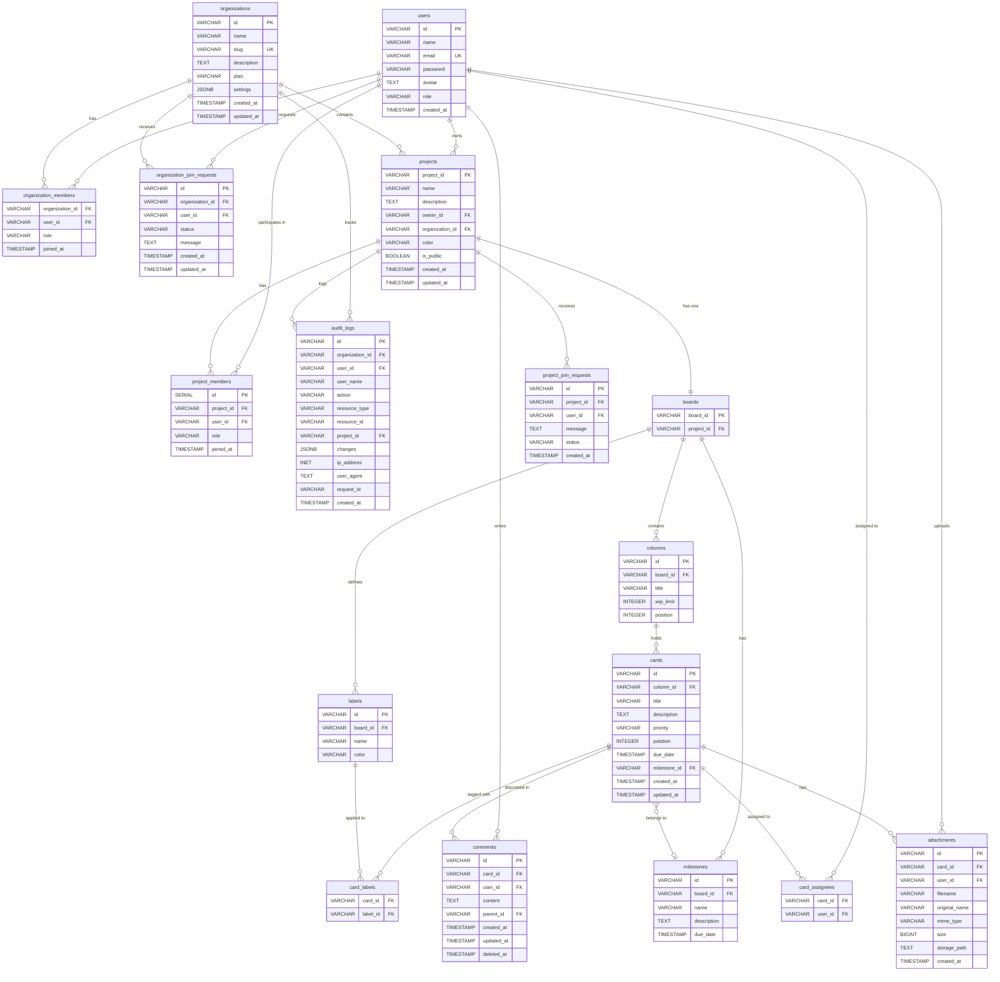

# Database Schema Diagram

## Entity Relationship Overview



## Table Relationships

### Multi-Tenancy Hierarchy

```
organizations (Top Level)
├── organization_members (Users in org)
├── organization_join_requests (Pending joins)
└── projects (Org's projects)
    ├── project_members (Users in project)
    ├── project_join_requests (Pending joins)
    └── boards (Project's kanban board)
        ├── columns (Board columns)
        │   └── cards (Tasks)
        │       ├── card_labels
        │       ├── card_assignees
        │       ├── comments
        │       └── attachments
        ├── milestones (Project milestones)
        └── labels (Label definitions)
```

### Key Relationships

#### User Access Flow
1. User joins organization (via organization_join_requests → organization_members)
2. User added to project (via project_join_requests → project_members)
3. User can view/edit cards based on project membership
4. User can be assigned to cards (card_assignees)

#### Data Isolation
- **Organization Level**: All projects belong to an organization
- **Project Level**: All boards belong to a project
- **Board Level**: All cards belong to columns within a board

#### Referential Integrity
- **CASCADE DELETE**: Deleting organization → deletes all projects, members, requests
- **CASCADE DELETE**: Deleting project → deletes board, members, cards
- **CASCADE DELETE**: Deleting board → deletes columns, cards, labels
- **SET NULL**: Deleting milestone → cards keep their other data

## Index Strategy

### Performance-Critical Indexes

1. **Foreign Key Indexes**: All FK columns for efficient joins
2. **Composite Indexes**: 
   - `(organization_id, role)` on organization_members
   - `(column_id, position)` on cards for drag-drop
3. **Full-Text Search**: GIN index on cards (title + description)
4. **Unique Constraints**:
   - `(organization_id, user_id)` on organization_members
   - `(project_id, user_id)` on project_members
   - `(card_id, label_id)` on card_labels

### Query Patterns Supported

- Find all projects in organization: `idx_projects_organization`
- Find user's organizations: `idx_org_members_user`
- Find cards by milestone: `idx_cards_milestone`
- Search cards: `idx_cards_fulltext`
- Audit trail by organization: `idx_audit_logs_org`

## Security Model

### Role Hierarchy

**Organization Roles** (strongest → weakest):
1. **owner**: Full control, can delete organization
2. **admin**: Manage members, create projects
3. **editor**: Create/edit content
4. **viewer**: Read-only access
5. **member**: Default member access

**Project Roles**:
1. **owner**: Project creator, full control
2. **member**: Can view and edit project content

### Access Control

- Organization members can only access projects in their organization
- Project members must also be organization members
- Row Level Security (RLS) policies can be enabled for additional isolation

## Data Flow Examples

### Creating a Card

```sql
-- 1. User must be in organization
SELECT * FROM organization_members 
WHERE user_id = $user_id AND organization_id = $org_id;

-- 2. User must be project member
SELECT * FROM project_members 
WHERE user_id = $user_id AND project_id = $project_id;

-- 3. Create card in column
INSERT INTO cards (id, column_id, title, description) 
VALUES ($id, $column_id, $title, $desc);

-- 4. Log action
INSERT INTO audit_logs (user_id, action, resource_type, resource_id) 
VALUES ($user_id, 'create', 'card', $id);
```

### Joining Organization

```sql
-- 1. User creates join request
INSERT INTO organization_join_requests (id, organization_id, user_id, message) 
VALUES ($id, $org_id, $user_id, $message);

-- 2. Admin/Owner approves
UPDATE organization_join_requests 
SET status = 'approved' 
WHERE id = $request_id;

-- 3. Add user as member
INSERT INTO organization_members (organization_id, user_id, role) 
VALUES ($org_id, $user_id, 'member');

-- 4. Delete request
DELETE FROM organization_join_requests WHERE id = $request_id;
```

## Maintenance Queries

### Check Data Integrity

```sql
-- Find cards without valid columns
SELECT c.* FROM cards c 
LEFT JOIN columns col ON c.column_id = col.id 
WHERE col.id IS NULL;

-- Find orphaned attachments
SELECT a.* FROM attachments a 
LEFT JOIN cards c ON a.card_id = c.id 
WHERE c.id IS NULL;

-- Check member consistency
SELECT pm.* FROM project_members pm
LEFT JOIN organization_members om 
  ON pm.user_id = om.user_id 
  AND (SELECT organization_id FROM projects WHERE project_id = pm.project_id) = om.organization_id
WHERE om.user_id IS NULL;
```

### Statistics

```sql
-- Organization statistics
SELECT 
  o.name,
  COUNT(DISTINCT om.user_id) as members,
  COUNT(DISTINCT p.project_id) as projects,
  COUNT(DISTINCT c.id) as total_cards
FROM organizations o
LEFT JOIN organization_members om ON o.id = om.organization_id
LEFT JOIN projects p ON o.id = p.organization_id
LEFT JOIN boards b ON p.project_id = b.project_id
LEFT JOIN columns col ON b.board_id = col.board_id
LEFT JOIN cards c ON col.id = c.column_id
GROUP BY o.id, o.name;

-- User activity
SELECT 
  u.name,
  COUNT(DISTINCT c.id) as comments,
  COUNT(DISTINCT ca.card_id) as assigned_cards,
  COUNT(DISTINCT a.id) as uploads
FROM users u
LEFT JOIN comments c ON u.id = c.user_id
LEFT JOIN card_assignees ca ON u.id = ca.user_id
LEFT JOIN attachments a ON u.id = a.user_id
GROUP BY u.id, u.name;
```
